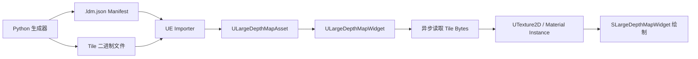
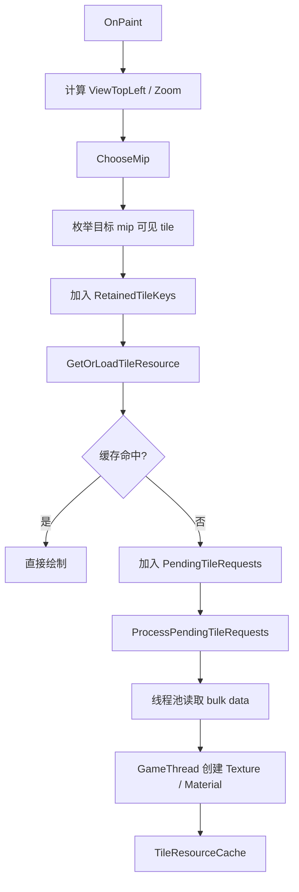
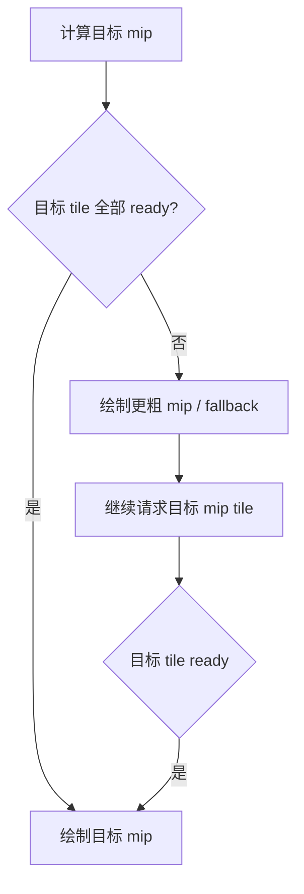

# LargeDepthMap 技术报告

## 目标与背景

`LargeDepthMap` 插件用于在 UMG/Slate UI 中显示超大深度图或高度图。典型输入分辨率可以达到 `16384 x 16384`、`32768 x 32768`，甚至更高。直接把完整贴图导入为单张 `UTexture2D` 会带来明显问题：导入流程受贴图尺寸限制影响，运行时会占用巨额显存，并且缩放或平移时很难只加载屏幕中真正需要的区域。

本系统采用离线切片、运行时异步加载、按需创建小纹理、Slate 分块绘制的方式实现。核心目标是让 UI 看起来像在显示一张完整超大图，但实际只让少量 tile 常驻显存。

## 总体结构

系统由四个主要部分组成：

1. `GenerateLargeDepthMapTiles.py`：离线生成或切分高度图，输出 tile 文件和 `.ldm.json` manifest。
2. `ULargeDepthMapAsset`：导入 `.ldm.json` 后生成的 Data Asset，保存 tile 元数据，并把 tile 原始二进制数据打包进 asset 的 bulk data。
3. `ULargeDepthMapWidget`：UMG 控件，负责 tile 请求、异步读取、纹理创建、缓存、释放和状态统计。
4. `SLargeDepthMapWidget`：Slate 控件，负责视口坐标计算、mip 选择、tile 绘制、fallback 绘制和 debug overlay。



## 数据生成与导入

离线阶段会为每个 mip 生成若干 tile。每个 tile 记录以下关键信息：

- `mip`：所属 mip 层级。
- `x/y`：tile 在该 mip 下的索引。
- `width/height`：tile core 区域尺寸，不包含 gutter。
- `stored_width/stored_height`：实际写入文件的尺寸，包含 gutter。
- `gutter`：边缘 padding 像素数，用于避免线性采样时出现 tile 边界缝。
- `path`：tile 二进制文件路径。

导入器读取 manifest 后，会把所有 tile 原始文件依次打包进 `ULargeDepthMapAsset` 的 bulk data 中，并把每个 tile 的 `DataOffset` 和 `DataSize` 写入元数据。这样 Content 目录中不需要长期管理大量松散 tile 文件，运行时也可以通过 offset 读取对应 tile 的二进制数据。

当前测试生成器已经改为分块生成。对于 `32768 x 32768` 这类尺寸，不再先构建完整 float 高度图，而是直接按 tile 的全局像素坐标生成 tile 数据。噪声函数使用全局坐标和 seed，因此相邻 tile 的边缘采样来自同一连续函数，能够保证边界连续。

## 运行时加载流程

运行时每帧会根据 UI 尺寸、缩放倍数和视口中心计算当前可见区域。控件会选择一个目标 mip，然后枚举该 mip 下覆盖屏幕的 tile。



加载过程是异步的：磁盘或 bulk data 读取在线程池中完成，`UTexture2D` 或 `UMaterialInstanceDynamic` 创建回到 Game Thread 完成。每帧启动的加载数量受 `MaxTileLoadStartsPerFrame` 限制，避免一次性提交过多请求造成卡顿。

## 纹理创建与材质路径

系统支持两种显示路径：

1. 无材质路径：把 Gray8/Gray16 数据转换为可视化 RGBA8 纹理，直接由 Slate 绘制。
2. 材质路径：创建原始 Gray8/Gray16 `UTexture2D`，再传给 `TileMaterial` 的 `DepthTexture` 参数，由艺术家材质决定显示方式。

推荐使用材质路径。这样可以保留原始高度或深度数据，并让材质控制颜色映射、阈值、等高线、mask、调试色等表现。材质中采样 UV 应使用 `GetUserInterfaceUV` 的 `9-Slice UV` 或 `9-Slice UV (No Tiling)`，或者保持 Texture Sample 默认 UI UV 约定。不要误用 `Normalized UV` 作为跨 mip fallback 的采样坐标，因为它只表示当前 Slate quad 的局部 `0..1`。

采样方式现在可以通过 `SamplingFilter` 配置：

- `Bilinear`：默认双线性采样，视觉更平滑。
- `Point`：点采样，用于分辨率和像素级测试。

该配置会写入运行时创建和复用的 `UTexture2D::Filter`。材质路径下，如果 Texture Sample 使用 texture asset sampler，则会跟随该设置；如果材质强制指定 sampler，则需要在材质内部同步修改。

## Mip 选择与稳定策略

系统根据 `SourcePixelsPerScreenPixel` 计算目标 mip，并通过 `MipRefineScreenPixels` 与 `MipCoarsenScreenPixels` 做滞回控制，避免在临界缩放点频繁来回切换。

目标 mip 的 tile 未完全 ready 时，系统会优先使用更粗 mip 或常驻 fallback mip 进行过渡。低分辨率 fallback 的目的不是提高质量，而是在目标 tile 进入屏幕但尚未加载完成的短时间内提供稳定内容，避免从空白或白色瞬间切入。



## Fallback UV 修正

一个重要问题曾出现在跨 mip fallback 中：当系统用父 mip 的一部分区域临时替代子 tile 时，UV 不能简单按 tile 索引比例计算。

错误假设是：

```text
LocalX = (TileX % ParentSpan) / ParentSpan
LocalSize = 1 / ParentSpan
```

这个公式只在父 tile 是完整规则 tile，且被子 tile 完全均分时成立。一旦父 tile 位于高 mip 或边界位置，它的实际 `Width/Height` 可能小于标准 `TileSize`，此时索引比例会映射到错误的纹理区域，导致同一世界区域在不同 mip 下颜色差异巨大。

修正后的逻辑基于真实像素范围：

```text
ChildMinInParentMip = ChildPixelMin / 2^(ParentMip - ChildMip)
ChildMaxInParentMip = ChildPixelMax / 2^(ParentMip - ChildMip)
LocalMin = (ChildMinInParentMip - ParentPixelMin) / ParentActualSize
LocalMax = (ChildMaxInParentMip - ParentPixelMin) / ParentActualSize
```

这样 fallback 采样区域和真实世界区域保持一致，解决了快速缩放和平移时出现大块颜色错误或闪动的问题。

## Gutter Padding 与边界缝

tile 文件可以包含 gutter padding。core 区域用于实际显示，gutter 区域用于线性采样时提供相邻边缘数据，减少 tile 接缝。

运行时会根据 `gutter/stored_width/stored_height` 计算 core UV：

```text
MinUV = gutter / stored_size
MaxUV = (gutter + core_size) / stored_size
```

对于材质路径，目前 raw texture 会从 tile 文件中裁掉 gutter，只创建 core 尺寸的 `UTexture2D`。对于无材质可视化路径，则使用包含 gutter 的可视化纹理，并通过 Slate Brush UVRegion 只绘制 core 区域。

## 缓存、释放与 Texture Pool

系统维护以下运行时集合：

- `TileResourceCache`：当前已创建的 tile resource。
- `PendingTileRequests`：等待启动的加载请求。
- `LoadingTileKeys`：正在异步加载的 tile。
- `MissingTileKeys`：加载失败的 tile。
- `PooledTextures`：可复用的 `UTexture2D`。
- `ReleasedTextures`：刚释放、等待短暂延迟后再进入 pool 的纹理。
- `ResidentTileKeys`：常驻 fallback mip tile。

释放策略由 `TileReleaseDelaySeconds` 控制。屏幕外 tile 不会立刻释放，而是在一段延迟后释放，以降低快速平移或缩放时反复创建和销毁纹理造成的抖动。释放时会同时清理对应 Slate Brush，避免 brush 仍然引用已复用的 texture resource。

## Debug 与状态显示

控件提供实时 status overlay，用于观察系统是否按预期异步加载和释放。当前状态信息分多行显示，并带半透明灰色背景。

主要字段包括：

- `mip`：当前选择的目标 mip。
- `visible/candidate/ready`：当前绘制、候选和已 ready 的 tile 数。
- `retained/resident/active/free/pending/loading/missing`：缓存与请求状态。
- `gpu MiB current/max/avg`：当前、峰值和平均估算显存占用。
- `packed`：Data Asset 内打包原始数据大小。
- `requests/hits/textures created/reused`：请求、缓存命中和纹理池复用统计。

还可以打开 tile mip overlay 和 debug label，直接在屏幕上观察每个 tile 当前使用的 mip、坐标和 fallback 来源。

## 压力测试结果

以下数值来自当前测试记录，单位为近似值。

| 测试分辨率 | 本地原始数据文件 | 峰值显存占用 | 平均显存占用 |
| --- | ---: | ---: | ---: |
| `32768 x 32768` | `2.86 GB` | `140 MB` | `44 MB` |
| `16000+ x 16000+` | 未记录 | `120 MB` | `44 MB` |

这些结果说明显存占用没有随完整图像分辨率线性增长，而主要取决于屏幕可见 tile 数、fallback mip 常驻数量、释放延迟、预加载半径和 texture pool 状态。

以 `32768 x 32768`、Gray16 为例，如果直接完整载入，原始数据本身就会达到 GB 级；当前方案在屏幕显示阶段峰值约 `140 MB`，平均约 `44 MB`，说明按需加载策略有效降低了运行时显存压力。

## 当前限制与注意事项

1. `ULargeDepthMapAsset` 仍然把所有 tile 数据打包在一个 Data Asset 中。UE 对 Data Asset 的加载/卸载粒度有限，因此 CPU 内存侧仍可能存在压力。后续如果要进一步降低 CPU 内存占用，可以考虑自定义外部 bulk 文件、IoStore chunk、或运行时文件句柄按 offset 读取。
2. 跨 mip fallback 的正确性依赖 tile 元数据准确，尤其是 `width/height/stored_width/stored_height/gutter`。
3. 艺术家材质必须遵守 UI UV 约定。推荐使用 `GetUserInterfaceUV` 的 `9-Slice UV` 或默认 Texture Sample UV，不推荐把 `Normalized UV` 直接当作 tile texture 采样 UV。
4. `Point` 采样适合测试像素边界和分辨率，不一定适合最终视觉表现。
5. 当前 Python 分块生成器为了低内存和边缘连续，使用确定性全局噪声函数直接按 tile 生成。它不再执行整图级 thermal erosion，因为完整 erosion 需要全图或复杂的流式边界状态。当前地形仍包含大陆形、山脊、细节噪声和基于全局噪声的河谷/沟壑效果。

## 建议回归测试流程

1. 用 Python 生成一份小尺寸数据，例如 `1024` 或 `2048`，确认导入流程和基本显示正常。
2. 打开 debug overlay，快速缩放和平移，观察 tile label 是否出现错误 fallback 坐标或大块颜色跳变。
3. 切换 `SamplingFilter` 为 `Point`，检查像素边界和 mip 切换是否符合预期。
4. 生成 `32768` 压测数据，记录 packed data、峰值 GPU MiB、平均 GPU MiB。
5. 调整 `PrefetchTileRadius`、`TileReleaseDelaySeconds`、`ResidentFallbackMip`，观察显存峰值与闪动情况之间的取舍。

